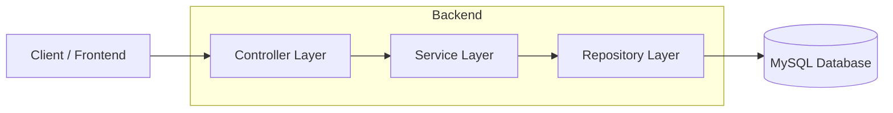
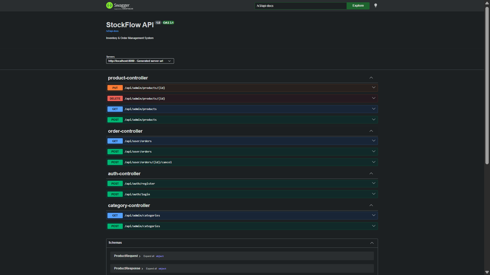
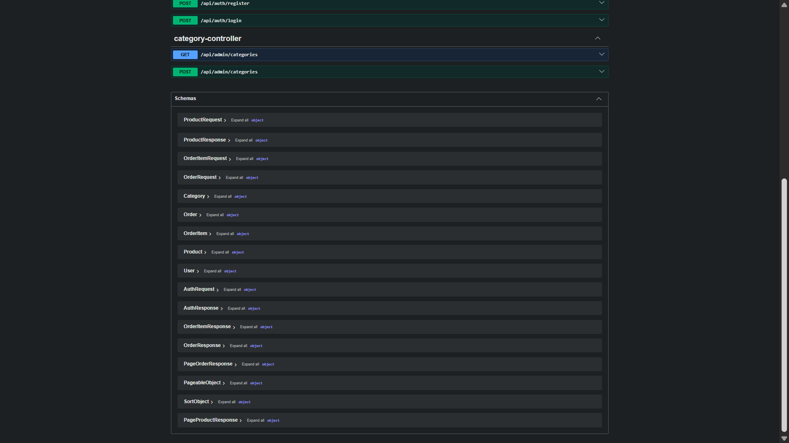

# 📧 📦 StockFlow — Inventory & Stock Management System API

A **secure, scalable, and production-style backend API** for managing inventory, tracking stock levels, and handling product lifecycle operations.

Built with **Java, Spring Boot, and MySQL**, this project demonstrates real-world backend engineering practices including authentication, pagination, filtering, and layered architecture.

---

## 🏗️ Architecture



---

## 🚀 Features

### 📦 Inventory Management

* Create, update, delete products
* Track stock quantity in real time
* Category-based product organization

### 🔐 Authentication & Security

* JWT-based authentication (if enabled)
* BCrypt password hashing
* Role-based access control (Admin/User)

### 📊 Stock Operations

* Increase/decrease stock quantity
* Low-stock tracking (future-ready)
* Inventory status monitoring

### 🔎 Filtering & Pagination

* Paginated product listing
* Filter products by category/status

### 👑 Admin Controls

* Full product management access
* User management (if enabled)

---

## 🔨 Tech Stack

| Layer    | Technology                   |
| -------- | ---------------------------- |
| Backend  | Java, Spring Boot, Maven     |
| Security | Spring Security, JWT, BCrypt |
| Database | MySQL                        |
| ORM      | Spring Data JPA, Hibernate   |
| Tools    | Postman, Git, GitHub         |

---

## 📂 Project Structure

```
StockFlow/
├── src/
│   ├── main/
│   │   ├── java/com/stockflow
│   │   │   ├── config/
│   │   │   ├── controller/
│   │   │   ├── dto/
│   │   │   ├── model/
│   │   │   ├── repository/
│   │   │   ├── service/
│   │   │   ├── exception/
│   │   └── resources/
│   │       ├── application.properties
```

---

## ⚡ Getting Started

### Prerequisites

* Java 17+
* Maven
* MySQL

---

### Installation

```bash
git clone https://github.com/Soumyajit173/StockFlow.git
cd StockFlow
mvn clean install
mvn spring-boot:run
```

---

## 📘 API Documentation

### 🔹 Swagger UI (if enabled)

```
http://localhost:8080/swagger-ui/index.html
```

---

## 📡 API Endpoints

### 📦 Product APIs

**Get all products**
`GET /api/products`

**Get product by ID**
`GET /api/products/{id}`

**Create product**
`POST /api/products`

```json
{
  "name": "Laptop",
  "category": "Electronics",
  "price": 55000,
  "quantity": 10
}
```

**Update product**
`PUT /api/products/{id}`

**Delete product**
`DELETE /api/products/{id}`

---

## 📊 Sample Response

```json
{
  "id": "101",
  "name": "Laptop",
  "category": "Electronics",
  "price": 55000,
  "quantity": 10
}
```

---

## 🔒 Security Highlights

* JWT authentication (if implemented)
* BCrypt password encryption
* Role-based authorization (Admin/User)

---

## 🧠 Key Concepts Demonstrated

* REST API design
* CRUD operations
* Layered architecture (Controller → Service → Repository)
* DTO-based design
* Exception handling
* Scalable backend structure

---

## 🔮 Future Improvements

* 🌐 React frontend dashboard
* 📊 Inventory analytics dashboard
* 📦 Barcode scanning system
* 📉 Low-stock alert system
* ☁️ Cloud deployment (Render / AWS)
* 🧾 Audit logs for stock changes
* 🔍 Advanced search & filtering

---

## 📸 Screenshots


```
docs/images
```

---

## 👨‍💻 Author

**Soumyajit Nandi**
GitHub: [https://github.com/Soumyajit173](https://github.com/Soumyajit173)

---

## ⭐ Support

If you found this project useful, consider giving it a ⭐ on GitHub!

---
